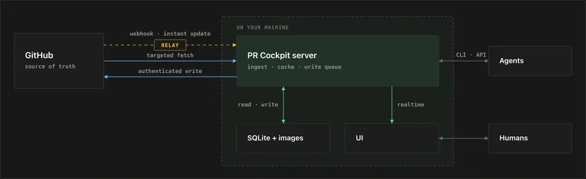

# PR Cockpit

**GitHub pull requests at local speed.**

PR Cockpit is a keyboard-first macOS and Linux app that keeps pull requests, diffs, threads, checks, and images warm on your machine. Reads feel immediate, while comments, reviews, edits, and merges sync through your existing `gh` login. GitHub remains the source of truth.

[Website](https://theolundqvist.github.io/pr-cockpit/) · [Install](#install) · [CLI](#agents-listen-dont-poll) · [Self-host relay](docs/self-host-relay.md) · [Shortcuts](#shortcuts)

## GitHub PRs at local speed

The local server serves the queue and open pull request from SQLite instead of rebuilding every screen from GitHub. Webhook markers trigger targeted refreshes, WebSocket invalidations update the UI, and a poller repairs missed events.

Warm-cache opens of a large private pull request with 1,879 changed files:

| Product | p50 | p95 | p99 |
| --- | ---: | ---: | ---: |
| PR Cockpit | 0.082 s | 0.112 s | **0.121 s** |
| Cursor Origin | 1.738 s | 3.702 s | 5.606 s |
| GitHub | 3.381 s | 4.880 s | 5.678 s |

A separate 12-run comparison of the common interactions, each a cold first open:

| Interaction | PR Cockpit p50 | GitHub p50 | Faster |
| --- | ---: | ---: | ---: |
| Open a PR | 0.020 s | 1.421 s | 71.8× |
| Open a diff | 0.041 s | 1.487 s | 36.2× |
| Search PRs | 0.049 s | 0.839 s | 17.1× |

At p99, PR Cockpit painted the same pull request **47× faster than GitHub**. [Methodology and reproduction](scripts/benchmark-ui.mjs).

## Search from anywhere

Press <kbd>⌥⌘K</kbd> from any app on macOS. On Linux X11, press <kbd>Super+Alt+K</kbd>; Wayland compositor policy can prevent the global shortcut. The full pull request opens from the local cache.


## One queue. Three lanes.

Ready to merge, your move, and waiting are separate lanes, already sorted by what needs attention. Stacked pull requests stay together. Checks, conflicts, unresolved threads, and review state are available without tab-hopping.


## Hide tests. See the change.

Press <kbd>x</kbd> to fold test files out of the diff. In `graphql/graphql-js#4692`, that leaves the one-line fix on screen.


## One key from review to change

The review stays in one context:

- <kbd>p</kbd> opens the pull request in the configured coding agent with the current review context.
- <kbd>e</kbd> edits the open file and commits the patch back to the pull request.
- **Revert hunk** removes one focused change instead of rewriting the file.
- <kbd>h</kbd> walks file history without leaving the review.

| Agent | Edit |
| --- | --- |
|  |  |

| Revert hunk | History |
| --- | --- |
|  |  |

## Agents: listen, don't poll.

The installer adds the open-source `pr-cockpit` CLI. It reads the same local cache as the app, returns compact agent-shaped output, and revalidates only when that cache is stale.

```sh
pr-cockpit owner/repo#123                    # state, checks, unresolved threads
pr-cockpit owner/repo#123 --diff             # cached diff
pr-cockpit owner/repo#123 --file src/app.ts  # full file at the PR head
pr-cockpit owner/repo#123 --jobs             # cached queued, running, and completed jobs
pr-cockpit owner/repo#123 --logs [check]     # cached failed and cancelled logs
pr-cockpit resolve owner/repo#123 HANDLE     # resolve a review thread
pr-cockpit update                            # fast-forward and rebuild
```

Waiting on CI, review, or a new comment? Block on the local fingerprint instead of polling GitHub:

```sh
pr-cockpit listen owner/repo#123
```

`listen` blocks until substantive cached state changes — a push, check result, review, or comment — then prints only what changed. `--ci-only` and `--comments-only` narrow the wake signal.

## Under the hood



- **GitHub is authoritative.** The local database is a warm read model, not a fork of pull-request state.
- **The relay carries markers, not pull-request payloads.** It also carries compact Actions run and job state, including runner assignment, but never full pull-request payloads or job logs.
- **Writes stay authenticated.** Comments, reviews, edits, thread resolution, and merges use the existing GitHub CLI login.
- **Humans and agents share one cache.** The app uses WebSocket invalidations; the CLI and API expose the same refreshed state.
- **Self-hosting is one Worker.** Deploy the relay to Cloudflare, create a GitHub App, and connect its URL—no separate database, server, or tunnel. [Complete self-hosting guide](docs/self-host-relay.md).

## Install

The same bootstrap command installs the native desktop app and `pr-cockpit` CLI on macOS or Linux:

```sh
curl -fsSL https://raw.githubusercontent.com/theolundqvist/pr-cockpit/main/scripts/bootstrap | bash
```

It detects the platform, checks prerequisites, asks before installing anything, shows each stage, and opens the four-step setup. On Linux it installs an immutable release, a user service, desktop entry, tray integration, and the `prcockpit://` handler; X11 is supported directly and Wayland sessions run through XWayland, where global shortcuts are compositor-dependent. Run `pr-cockpit update` to upgrade. On Linux, `$HOME/.pr-cockpit/scripts/uninstall` removes the app and `--purge` also removes local data.

## Start in four steps

1. Connect your existing GitHub CLI login.
2. Choose repositories.
3. Enable live updates.
4. Open the review queue.

Run **Settings → Run setup again** whenever you want to change repositories or live updates.

## Shortcuts

| Key | Action |
| --- | --- |
| <kbd>⌥⌘K</kbd> macOS<br><kbd>Super+Alt+K</kbd> Linux X11 | Search pull requests globally; Wayland depends on compositor policy |
| <kbd>j</kbd> / <kbd>k</kbd> | Move |
| <kbd>enter</kbd> / <kbd>esc</kbd> | Open / back |
| <kbd>d</kbd> | Conversation / Files |
| <kbd>c</kbd> / <kbd>r</kbd> | Comment / reply |
| <kbd>p</kbd> | Open in the configured agent |
| <kbd>e</kbd> | Edit the open file |
| <kbd>x</kbd> | Hide / show test files |
| <kbd>h</kbd> | File history |
| <kbd>m</kbd> | Merge |
| <kbd>?</kbd> | Full cheatsheet |

<details>
<summary><strong>Configuration</strong></summary>

Settings live in the app. Optional shell overrides live in `~/.config/pr-cockpit/config`.

| Variable | Purpose |
| --- | --- |
| `COCKPIT_REPOS` | Comma-separated `owner/repo` list |
| `COCKPIT_PORT` | Local HTTP port; defaults to `4820` |
| `COCKPIT_DEFAULT_REPO` | Repository assumed when a PR number is passed alone |
| `COCKPIT_REPO_ROOTS` | Paths containing local checkouts |
| `COCKPIT_RELAY_URL` | [Self-hosted webhook relay](docs/self-host-relay.md) |

</details>

## Contributions welcome

Functionality, themes, visual polish, and fixes for rough UI edges are all welcome.

New functionality must default off. Styling must be opt-in unless it is minor polish that preserves the default appearance.

Every pull request must attach before-and-after screenshots showing its effect in the app.
